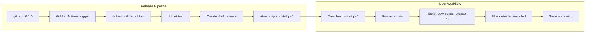

# Installer Script & Release Pipeline Design

**Date:** 2026-06-27
**Status:** Draft

## 1. Goal

Provide a one-command PowerShell installer (`install.ps1`) that deploys NeuroRoute as a production Windows Service with minimal user interaction, handling:

- Fresh install from GitHub release zip or local source build
- FastFlowLM (FLM) detection and installation (sideload or global)
- Windows Service registration via `sc.exe`
- `appsettings.json` generation with correct defaults
- Start Menu shortcuts for Dashboard and Tray
- Clean uninstall

Paired with a GitHub Actions workflow that tags, builds, tests, and publishes draft releases.

## 2. System Overview

```
  User runs install.ps1
         │
         ▼
  ┌──────────────────────────────────────────────────┐
  │               install.ps1                         │
  │                                                    │
  │  Phase 0: Elevation & Pre-checks                  │
  │  Phase 1: FLM Detection & Install                 │
  │  Phase 2: NeuroRoute Download or Build            │
  │  Phase 3: Configuration Generation                │
  │  Phase 4: Service Registration                    │
  │  Phase 5: Start Menu & Shortcuts                  │
  │  Phase 6: Summary                                 │
  └──┬───────────────────────────────────────────────┘
     │
     ▼
  ┌──────────────────────────────────────────────────┐
  │          C:\Program Files\NeuroRoute\             │
  │                                                    │
  │  NeuroRoute.Service.exe       Service binary       │
  │  NeuroRoute.Tray.exe          Tray binary          │
  │  appsettings.json             Generated config     │
  │  flm\flm.exe                  Sideloaded FLM       │
  │  *.dll                        Framework DLLs       │
  └──────────────────────────────────────────────────┘
```

## 3. Flow Diagram

```mermaid
flowchart TD
    A[Start install.ps1] --> B{Admin?}
    B -->|No| C[Exit: must run as admin]
    B -->|Yes| D[Parse parameters]
    
    D --> E{Uninstall mode?}
    E -->|Yes| F[Stop service<br/>sc delete<br/>Remove files<br/>Remove shortcuts<br/>Exit]
    E -->|No| G[Detect OS arch = x64]
    
    G --> H{FlmMode param}
    H -->|Sideload| I1[Check if FLM already installed globally]
    H -->|Global| I2[Run flm-setup.exe /VERYSILENT]
    H -->|Skip| I3[Skip FLM entirely]
    
    I1 --> J1{FLM found?}
    J1 -->|Yes| J2[Ask user: Use global /<br/>Sideload ours / Skip]
    J1 -->|No| J3[Download flm-setup.exe<br/>Run /VERYSILENT /DIR=...]
    J2 --> J3
    
    I2 & I3 & J3 --> K{BuildFromSource?}
    
    K -->|Yes| L1[dotnet publish Service + Tray<br/>to InstallDir]
    K -->|No| L2[Download NeuroRoute-v{VERSION}.zip<br/>from GitHub release<br/>Extract to InstallDir]
    
    L1 & L2 --> M[Generate appsettings.json]
    M --> N[sc.exe create NeuroRoute]
    N --> O[sc.exe start NeuroRoute]
    
    O --> P{ServiceOnly?}
    P -->|No| Q[Create Start Menu shortcuts<br/>Dashboard URL + Tray + Uninstall]
    P -->|Yes| R[Skip shortcuts]
    
    Q & R --> S[Print green summary<br/>with next steps]
    S --> T[Exit 0]
```



## 4. Parameters

| Parameter | Type | Default | Description |
|-----------|------|---------|-------------|
| `-Version` | string | `0.1.0` | Release version to download |
| `-BuildFromSource` | switch | false | Build from local source instead of downloading |
| `-FlmMode` | string | `"Sideload"` | `Sideload`, `Global`, or `Skip` |
| `-ServiceOnly` | switch | false | Skip Tray app + shortcuts |
| `-InstallDir` | string | `"$env:ProgramFiles\NeuroRoute"` | Target directory |
| `-Uninstall` | switch | false | Remove everything |
| `-DraftToken` | string | `""` | GitHub token to download draft release assets |

## 5. Phase Details

### Phase 0 — Elevation & Pre-checks

```pwsh
# Require admin
if (-NOT ([Security.Principal.WindowsPrincipal] [Security.Principal.WindowsIdentity]::GetCurrent()).IsInRole(
    [Security.Principal.WindowsBuiltInRole]::Administrator)) {
    Write-Host "Restarting as administrator..." -ForegroundColor Yellow
    Start-Process pwsh.exe -Verb RunAs -ArgumentList "-File `"$PSCommandPath`"", $MyInvocation.Line
    exit
}

# OS + arch check
if ([Environment]::Is64BitOperatingProcess -eq $false) {
    Write-Host "NeuroRoute requires 64-bit Windows." -ForegroundColor Red
    exit 1
}

# .NET runtime warning (optional, since self-contained includes it)
```

### Phase 1 — FLM Handling

```
FlmMode = "Sideload" (default):
  1. Check if flm.exe in PATH or HKLM environment
  2. If found globally:
     - Show version and location
     - Interactive prompt: [U]se global | [S]ideload ours | [K]eep both | [S]kip
  3. If not found (or user chose sideload):
     - Download flm-setup.exe from GitHub releases/latest
     - Run: flm-setup.exe /VERYSILENT /DIR="$InstallDir\flm"
     - Verify flm.exe exists in target directory
     - FLM_MODEL_PATH and FLM_SERVE_PORT env vars are set automati-
       cally by the installer (defaults: %USERPROFILE%\.flm, 52625)

FlmMode = "Global":
  - Run: flm-setup.exe /VERYSILENT
  - Accept default install dir (C:\Program Files\flm)

FlmMode = "Skip":
  - Do nothing. Config will use NpuBackend: "onnx"
```

**Why `/VERYSILENT` works:** The `flm.iss` Inno Setup script confirms this flag skips all custom pages (license, model path, port, desktop icon, Start Menu group) using their respective defaults.

### Phase 2 — NeuroRoute Acquisition

**Download mode** (`-BuildFromSource` not set):

```pwsh
$releaseUrl = "https://github.com/mrctrn/NeuroRoute/releases/download/v$Version/NeuroRoute-v$Version.zip"
$zipPath = "$env:TEMP\NeuroRoute-v$Version.zip"

Write-Host "Downloading NeuroRoute v$Version..." -ForegroundColor Cyan
Invoke-WebRequest -Uri $releaseUrl -OutFile $zipPath

Write-Host "Extracting to $InstallDir..." -ForegroundColor Cyan
Expand-Archive -Path $zipPath -DestinationPath $InstallDir -Force
```

**Build mode** (`-BuildFromSource` set):

```pwsh
Write-Host "Building NeuroRoute from source..." -ForegroundColor Cyan

dotnet publish "$PSScriptRoot\NeuroRoute.Service\NeuroRoute.Service.csproj" `
  -c Release -r win-x64 --self-contained -o "$InstallDir"

dotnet publish "$PSScriptRoot\NeuroRoute.Tray\NeuroRoute.Tray.csproj" `
  -c Release -r win-x64 --self-contained -o "$InstallDir"
```

### Phase 3 — Configuration Generation

Generated `appsettings.json`:

```json
{
  "NeuroRoute": {
    "NpuBackend": "flm",
    "NpuFlmModelTag": "gemma4-it:e4b",
    "NpuFlmEndpoint": "http://127.0.0.1:52625",
    "NpuModelPath": "Models/gemma-4-int4.onnx",
    "GpuEndpoint": "http://localhost:8080",
    "NpuLimit": 65536,
    "NpuSlice": 2048,
    "GpuMaxRetries": 3,
    "GpuTimeoutSeconds": 300,
    "UseMockBackends": false
  },
  "Kestrel": {
    "Endpoints": {
      "Http": {
        "Url": "http://localhost:5000"
      }
    }
  },
  "Logging": {
    "LogLevel": {
      "Default": "Information",
      "Microsoft.AspNetCore": "Warning",
      "NeuroRoute": "Information"
    }
  }
}
```

Logic:
- If FLM sideloaded → `NpuBackend: "flm"`
- If FLM skipped → `NpuBackend: "onnx"`
- GPU endpoint always `http://localhost:8080` (user changes if needed)

### Phase 4 — Service Registration

```pwsh
sc.exe create NeuroRoute `
  binPath="\"$InstallDir\NeuroRoute.Service.exe\" --content-root \"$InstallDir\"" `
  start=auto

sc.exe description NeuroRoute "Hybrid NPU-to-GPU routing gateway for local LLM execution"

Start-Service NeuroRoute

# Wait for health endpoint
$timeout = 30
$elapsed = 0
while ($elapsed -lt $timeout) {
    try {
        $health = Invoke-RestMethod -Uri "http://localhost:5000/v1/health"
        if ($health.status -ne "unhealthy") { break }
    } catch {}
    Start-Sleep -Seconds 1
    $elapsed++
}
```

### Phase 5 — Start Menu Shortcuts

```pwsh
$startMenuPath = [Environment]::GetFolderPath("CommonStartMenu") + "\Programs\NeuroRoute"

New-Item -ItemType Directory -Path $startMenuPath -Force | Out-Null

# Dashboard URL shortcut
$wshell = New-Object -ComObject WScript.Shell
$shortcut = $wshell.CreateShortcut("$startMenuPath\NeuroRoute Dashboard.url")
$shortcut.TargetPath = "http://localhost:5000"
$shortcut.Save()

# Tray app shortcut
$shortcut = $wshell.CreateShortcut("$startMenuPath\NeuroRoute Tray.lnk")
$shortcut.TargetPath = "$InstallDir\NeuroRoute.Tray.exe"
$shortcut.WorkingDirectory = "$InstallDir"
$shortcut.Save()

# Uninstall shortcut
$shortcut = $wshell.CreateShortcut("$startMenuPath\Uninstall NeuroRoute.lnk")
$shortcut.TargetPath = "pwsh.exe"
$shortcut.Arguments = "-File `"$InstallDir\install.ps1`" -Uninstall"
$shortcut.Save()
```

### Phase 6 — Summary

```
Write-Host @"

✓ NeuroRoute Service installed and running
  Service: NeuroRoute
  Binary:  $InstallDir\NeuroRoute.Service.exe
  Port:    http://localhost:5000

✓ FastFlowLM installed (sideloaded at $InstallDir\flm\)
  Server:  http://127.0.0.1:52625

✓ Start Menu shortcuts created
  NeuroRoute Dashboard (http://localhost:5000)
  NeuroRoute Tray
  Uninstall NeuroRoute

Next steps:
  1. Start a GPU backend (LM Studio, llama.cpp, etc.) on http://localhost:8080
  2. Launch NeuroRoute Tray from Start Menu (auto-starts on login)
  3. Open Dashboard: http://localhost:5000
  4. If using FLM backend, pull a model: flm pull gemma4-it:e4b

"@ -ForegroundColor Green
```

## 6. Uninstall Flow

```
install.ps1 -Uninstall

  Phase 0: Stop-Service NeuroRoute
  Phase 1: sc.exe delete NeuroRoute
  Phase 2: Remove Start Menu shortcuts
  Phase 3: Remove HKCU\...\Run\NeuroRoute.Tray (registry auto-start)
  Phase 4: Remove-Item -Recurse $InstallDir
  Phase 5: (If FLM was sideloaded) FLM files removed with directory
  Phase 6: Summary
```

Note: If FLM was installed globally (not sideloaded), uninstall does NOT remove the global FLM installation. Only NeuroRoute's own files are removed.

## 7. GitHub Actions Release Workflow

**File:** `.github/workflows/release.yml`

```yaml
name: Release

on:
  push:
    tags: 'v*'

jobs:
  build:
    runs-on: windows-latest
    
    steps:
      - uses: actions/checkout@v4
        with:
          fetch-depth: 0
      
      - name: Extract version from tag
        shell: pwsh
        run: |
          $tag = "${{ github.ref_name }}"
          $version = $tag.TrimStart('v')
          echo "VERSION=$version" >> $env:GITHUB_ENV
      
      - name: Setup .NET
        uses: actions/setup-dotnet@v4
        with:
          dotnet-version: '10.0.x'
      
      - name: Write version to Directory.Build.props
        shell: pwsh
        run: |
          $content = @"
          <Project>
            <PropertyGroup>
              <Version>$env:VERSION</Version>
              <FileVersion>$(Version)</FileVersion>
              <InformationalVersion>$(Version)</InformationalVersion>
            </PropertyGroup>
          </Project>
          "@
          Set-Content -Path Directory.Build.props -Value $content -Encoding UTF8
      
      - name: Build Service
        run: dotnet publish .\NeuroRoute.Service\NeuroRoute.Service.csproj -c Release -r win-x64 --self-contained -o publish\service
      
      - name: Build Tray
        run: dotnet publish .\NeuroRoute.Tray\NeuroRoute.Tray.csproj -c Release -r win-x64 --self-contained -o publish\tray
      
      - name: Run unit tests
        run: dotnet test .\NeuroRoute.Tests --no-restore
      
      - name: Create release archive
        shell: pwsh
        run: |
          New-Item -ItemType Directory -Path publish\combined -Force
          Copy-Item -Path publish\service\*,publish\tray\* -Destination publish\combined
          Compress-Archive -Path publish\combined\* -DestinationPath "NeuroRoute-v$env:VERSION.zip"
      
      - name: Create draft release
        uses: softprops/action-gh-release@v2
        with:
          draft: true
          name: "NeuroRoute v${{ env.VERSION }}"
          files: |
            NeuroRoute-v${{ env.VERSION }}.zip
            install.ps1
```

**Key decisions:**
- **Draft = true** — project is not public yet; releases are manually reviewed
- **Unit tests only** — integration tests require running Service + Dashboard, skipped in CI
- **Self-contained publish** — includes .NET runtime, no dependency on target machine's SDK
- **install.ps1 included** as a release asset alongside the zip

## 8. Directory Layout (Target)

```
C:\Program Files\NeuroRoute\
├── NeuroRoute.Service.exe          Service binary (self-contained)
├── NeuroRoute.Tray.exe             Tray binary (self-contained)
├── appsettings.json                Generated by installer
├── install.ps1                     Copied for re-run / uninstall reference
├── flm\                            Sideloaded FastFlowLM (if FlmMode=Sideload)
│   └── flm.exe
└── *.dll                           Framework DLLs

Start Menu:
  %ProgramData%\Microsoft\Windows\Start Menu\Programs\NeuroRoute\
    ├── NeuroRoute Dashboard.url
    ├── NeuroRoute Tray.lnk
    └── Uninstall NeuroRoute.lnk
```

## 9. Versioning Flow

```
git tag v0.1.0
       │
       ▼
  ┌──────────────────────┐
  │  Directory.Build.props│  <Version>0.1.0</Version>
  └──────────┬───────────┘
             │
     ┌───────┴───────┐
     ▼               ▼
  Service.dll     Tray.exe
  Version: 0.1.0  Version: 0.1.0
     │               │
     └───────┬───────┘
             ▼
      HealthService
  AssemblyInformationalVersion
      returns "0.1.0"
             │
             ▼
     GET /v1/health
  { "version": "0.1.0", ... }
```

## 10. Edge Cases & Error Handling

| Scenario | Handling |
|----------|----------|
| Port 5000 already in use | Service start fails → printed in summary with `sc.exe qc` and suggested fix |
| FLM installer fails | Log error, set `NpuBackend: "onnx"` in config as fallback, continue |
| No GPU backend running | Service works — NPU-only mode. GPU calls will fail gracefully |
| Network down (download mode) | Fallback: suggest `-BuildFromSource` or manual download |
| Already installed | Detect existing service, ask to overwrite or upgrade |
| Token expired while downloading draft release | Print message with curl command for manual download |
| FLM_MODEL_PATH already set | Preserve existing env var, don't override |
| `flm.exe` already in PATH when sideloading | Offer interactive choice (use global / sideload / both / skip) |

## 11. Implementation Order

1. Create `Directory.Build.props` with `<Version>0.1.0</Version>`
2. Create `install.ps1` with all 6 phases, all error handling
3. Verify FLM silent install works with `/VERYSILENT /DIR=...` (confirmed)
4. Create `.github/workflows/release.yml`
5. Update `CHANGELOG.md` — add `v0.1.0` section
6. Update `docs/DEPLOYMENT.md` — add installer section
7. Full integration test:
   - Run `install.ps1 -BuildFromSource -FlmMode Skip` on clean machine
   - Run `install.ps1 -BuildFromSource -FlmMode Sideload` on machine with FLM already
   - Run `install.ps1 -Uninstall` and verify cleanup
8. Tag `v0.1.0`, push, verify draft release created
9. Test download-mode install from draft release using `-DraftToken`

## 12. Risks & Open Questions

- **Draft release downloads** — GitHub draft releases require authentication. The `-DraftToken` parameter handles this, but users without a token must use `-BuildFromSource`. After the first public release, drafts are no longer needed.
- **FLM version pinning** — Sideload always gets latest FLM. If a specific FLM version is needed, add `-FlmVersion` in future.
- **Upgrade path** — v0.x uses flat layout at `C:\Program Files\NeuroRoute\`. Future versions may add versioned subdirectories with junction points. For now, upgrades re-run the same script which overwrites in-place after `sc.exe` stop.
- **Service user context** — FLM environment variables (`FLM_MODEL_PATH`, `FLM_SERVE_PORT`) are set at SYSTEM level by the FLM installer. This is necessary because the NeuroRoute service runs as `LocalSystem` and needs to see these variables.

## 13. Validation Tests

**File:** `tests/install-validation.ps1`

A standalone PowerShell script (no Pester dependency) that validates the installer in two phases:

### Phase 1 — Logic Tests (no admin, ~2s)

| Test | What it checks |
|------|---------------|
| Version parsing | `Read-VersionFromProps` returns `0.1.0` from `Directory.Build.props` |
| FLM config gen | `Build-NeuroRouteConfig -NpuBackend "flm"` produces correct keys |
| ONNX config gen | `Build-NeuroRouteConfig -NpuBackend "onnx"` sets `NpuBackend=onnx` |
| JSON structure | Config serializes to valid JSON with NeuroRoute/Kestrel/Logging sections |
| FLM detection | `Test-FlmInPath` runs without errors |
| Admin check | `Test-Administrator` completes |

### Phase 2 — Integration Tests (admin required, ~60s)

| Test | What it checks |
|------|---------------|
| Install from source | Runs `Invoke-Install` with `-BuildFromSource -FlmMode Skip -Confirm:$false` to a temp directory |
| File layout | Service EXE, Tray EXE, `appsettings.json`, and `install.ps1` copy all present |
| Config content | `NpuBackend=onnx` and `Kestrel.Endpoints.Http.Url=:5000` |
| Service creation | `Get-Service NeuroRoute` exists with `Automatic` start type |
| Clean uninstall | Runs `Invoke-Uninstall`, verifies service deleted and directory removed |

### Running

```pwsh
# Phase 1 only (no admin needed)
.\tests\install-validation.ps1

# Full validation (admin required for Phase 2)
Start-Process pwsh.exe -Verb RunAs -ArgumentList '-NoProfile -File ".\tests\install-validation.ps1" -SkipIntegration:$false'

# Or from an already-elevated prompt
.\tests\install-validation.ps1 -SkipIntegration:$false
```

### How It Works

The validation script dot-sources `install.ps1`, which loads all functions without running `Main` thanks to the guard:

```powershell
if ($MyInvocation.InvocationName -ne '.') {
    Main
}
```

Phase 2 calls `Invoke-Install` and `Invoke-Uninstall` directly in-process (no subprocess spawning), making output visible and errors debuggable.
